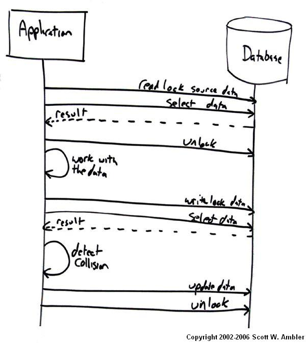
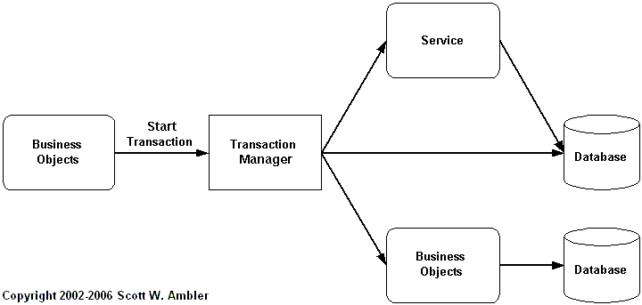

> 原文： <http://www.agiledata.org/essays/concurrencyControl.html>

この記事は、[Agile Database Techniques](http://www.ambysoft.com/agileDatabaseTechniques.html) Chapter 17をまとめたものである。 

私とあなた、二人が同時に Customer テーブルの同一行を読み取り、更新、コミットを行うとする。
このとき、どちらの変更が反映されるのであろう？
私？あなた？どちらでもない？それとも両方？
同様に、双方が共有のオブジェクトキャッシュから取り出したまったく同じ Customer オブジェクトを更新しようとしたとき、何が起こるだろうか？

並行処理制御では、共有エンティティ、オブジェクト、データ行などへの同時アクセスを扱う。
システムへどのように並列処理制御を実装するかを理解するためには、まず、コリジョン（訳注: 衝突）の基本 - コリジョンを回避するか、検出して対処するか - を理解することから始めなければならない。
その次のステップはトランザクション - 2つ、またはそれ以上のエンティティが変更される一連の処理 - を理解することである。

トランザクションの例としては、二つの銀行口座間での預金の転送（訳注: いわゆる振込）が挙げられる。
このトランザクションは転送元の口座からの引き落としと、転送先の口座への払い込み、そして履歴の記録の3つで構成される。

この章で述べている重要なポイントは、最近のソフトウェア開発プロジェクトでは並行処理制御やトランザクションがデータベースの領域に留まらず、アーキテクチャ構造の全ての層に潜在的に関係する問題である、ということである。

# 1. アジャイルな DBA の役割

並行処理制御における、アジャイルな DBA の役割は明確である。

- アプリケーションプログラマへ並行処理制御の方法について助言する
- 企業の管理者やアーキテクトと共に、その企業の標準を学習し、向上を図る
- 他のチームと共に、並行処理制御のためのアプローチの選別を行う
- アプリケーションプログラマと共に並行処理制御の実装を行う

# 2. コリジョン

[参照整合性と共有ビジネスロジックの実装](ImplementingReferentialIntegrityAndSharedBusinessLogic)では、データスキーマにマッピングされたオブジェクトのスキーマの参照整合性に関する問題について議論している。
私はこれをクロススキーマの参照整合性問題と呼ぶ事にしている。
コリジョンに関しては、事は少し単純であり、レコードシステム内のエンティティの一貫性を保証するという問題にだけ気をつける必要がある。
レコードシステムとは、（訳注: 正常にcommitされた）正規のエンティティを保持するものである。
データは、XMLやオブジェクトのような形式もあるが、多くはリレーショナルデータベースに格納される。

通常、コリジョンは2つのトランザクションの処理中、または処理完了したアクティビティがレコードシステム内のエンティティを変更する際に発生する。
片方のアクティビティが他方のアクティビティに及ぼす影響は、基本的に以下の3つである。

- ダーティーリード
- ノンリピータブルリード
- ファントムリード

どう対処すれば良いのだろうか。
まず最初に、コリジョンを回避することはできるが、パフォーマンスを低下させてしまう悲観的ロックを利用するアプローチが考えられる。
次に、コリジョンを検知して対処する楽観的ロック戦略を使うことも出来る。
そして、この問題を完全に無視する超楽観的ロックという方法を選択することも出来るだろう。

## 2.1 悲観的ロック

悲観的ロックとは、エンティティがアプリケーションのメモリ中にある（通常、オブジェクト形式となっている）間は常にデータベースをロックしておくというアプローチだ。
ロックすることによって、他のユーザがデータベースのエンティティを利用するのを限定、または禁止する。
書き込みロックは、ロックを保持しているユーザがエンティティを更新するときに利用するものであり、他のユーザがエンティティを読み込み、更新、削除できないようにする。
読み取りロックは、ロックを保持しているユーザがエンティティを変更しないときに利用するものであり、ロック中に他のユーザはエンティティを読み込むことは可能であるが、更新や削除はできない。
ロックの範囲は、データベース全体、一つのテーブル、複数行、または単一行となる。
これらのロックはそれぞれ、データベースロック、テーブルロック、ページロック、行ロックと呼ばれる。

悲観的ロックの利点は実装が簡単であり、データベースへの変更が一貫して安全に行われることが保証されることである。
最大の欠点は、スケーラビリティが極端に低下することだ。
システムのユーザが多い、大量のエンティティを処理する、長いトランザクションがある場合などにロックの開放待ちが長くなってしまう。
よって、システムが同時に処理できるユーザ数を制限することになるだろう。

## 2.2 楽観的ロック

マルチユーザーシステムであってもコリジョンが発生するのはまれなことである。
私たち2人が Customer オブジェクトを利用しているとしても、あなたが扱っているのが Wayne Miller オブジェクトであり、私が John Berg オブジェクトならば、コリジョンは発生しない。
このようなケースでは、並行処理制御として楽観的ロックを利用することができる。
このアイデアは、コリジョンの発生がまれであり、また、コリジョンを防ぐのではなくコリジョンの発生を検出して処置を行うという方針に基づいている。

図 1 は、楽観的ロックを利用したオブジェクトの更新ロジックの図である。
アプリケーションはメモリ内へオブジェクトを読み込む。
最初にデータの読み取りロックを獲得し、データをメモリ内へ読み込み、最後に獲得したロックを開放する。
この時点で衝突を検知できるよう、対象行がマーク（これについては後述）される。
その後、アプリケーションはオブジェクトの更新が必要となる操作を行う。
そして、データの書き込みロックを獲得し、コリジョンの発生を確認するために再度元データを読み取る。
コリジョンが発生していないことがわかると、データを更新して、ロックを開放する。
コリジョンを検知した場合、例えばデータを読み込んだ後に他のプロセスによってデータが更新されていた場合は、コリジョンの対処を行う必要があるだろう。

*図 1. 楽観的ロックアプローチによるオブジェクトの更新*

コリジョンの発生を検知する基本的な方法は以下の2つである。

- 一意の識別子で元データをマークする。
- 元データのコピーを保持しておく。

図 1 は安直なアプローチを描いたものだ。データベースとのやり取りの数はもっと抑えることができる。
最初の3つのデータベースへのリクエスト - 最初のロック、（必要に応じて）元データのマーキング、ロックの開放 - は一回で実行することができる。
次の2つのやり取り、ロックの獲得と元データのコピーの取得も組み合わせて一回にすることが簡単にできる。
さらに、更新とロックの開放も同様に組み合わせられる。
別の改善方法としては、最後の4つのやり取りを組み合わせて一つの処理とし、衝突の検知をアプリケーションサーバではなくデータベースサーバにまかせてしまえばいい。

## 2.3 コリジョンの解決方法

コリジョンを解決するには、基本的に以下の5つの方法がある。

1. あきらめる。
1. 問題の内容を表示し、ユーザが決定する。
1. 変更をマージする。
1. 問題の内容を記録し、後で決定する。
1. コリジョンを無視し、上書きする。

コリジョンの詳細を把握することは重要である。
私たちが同じ Customer エンティティのコピーを利用していると仮定しよう。
あなたが Customer の名前を更新し、私が（★）shopping preferencesを更新しているのであれば、コリジョンから回復することができる。
同じ Customer を更新し、コリジョンがエンティティレベルでは発生したが、属性レベルではコリジョンは発生していない。
エンティティレベルのコリジョンを検知したときに、属性レベルでの解決を行うことは非常に一般的である。

## 2.4 超楽観的ロック

コリジョンが発生しないことを前提に、回避も検知も行わない方法である。
この戦略はシングルユーザのシステム、つまりレコードシステムがただ1人のユーザ、あるいはシステムプロセスだけによってアクセスされることを保証されるシステムの場合に有効である。
この手のシステムはほとんど見かけはしないものの、存在する。
この方法はマルチユーザのシステムでは完全に役立たずであることは重要なので頭の片隅に留めておかなければならない。

# 3. トランザクション

定義から始めよう。Bernstein and Newcomer (1997)では、ビジネス トランザクションとオンライン トランザクションとを区別している。
ビジネス トランザクションとは、現実世界（企業と人との間）で何かがやり取りされることを指す。
オンライン トランザクションとは、共有データ ソースにアクセスする管理機能またはリアルタイム機能のプログラム実行のことを指す。これは通常、オンライン ユーザーのために行われる（オフラインのバッチ処理で行われても）。
このトランザクション問題には、ビジネス トランザクションに関係したステップが含まれている。
このオンライン トランザクションの定義は重要で、
データベース トランザクション以外にも議題があることを明確にしてくれる。

## 3.1. トランザクションの基本

この節では、トランザクションを基本について触れる。
まずは、トランザクションに不慣れなアプリケーション開発者にとって、オーバービューとなるようなものから述べる。重要な概念は、以下の通りである。

- ACID 
- 二相コミット（Two-phase commits）
- 入れ子トランザクション（NNested transactions）

### 3.1.1. ACID特性
トランザクションにおいて重要な特性が4つある。4つの特性とは、以下の通りである。

- 原子性（Atomicity）
- 一貫性（Consistency）
- 独立性（Isolation）
- 耐久性（Durability）

### 3.1.2. 二相コミット
名前が示す通り、2PCプロトコルを使う2つのフェーズが存在する。
各システムがサブトランザクションを行う準備フェーズと、
各システムがトランザクションを永続化するよう指示されるコミット フェーズである。

2PCプロトコルでは、トランザクションを管理するトランザクション マネージャが必要となる。トランザクション マネージャはトランザクションに一意のトランザクションIDを割り当てる。
トランザクション マネージャは様々なトランザクション ステップを各システム レコードに送信し、準備を行う。各システムはトランザクション マネージャに準備結果を返信する。
この時点で準備ステップが成功ならば、
システム レコードはコミットフェーズまで適切なエンティティをロックし、
潜在的な変更点を一定の手順で永続化する必要がある（耐久性の確保）。
トランザクション マネージャがすべてのシステム レコードから上記ステップの成功（または失敗）の返信を受け取ると、コミット（またはアボート）リクエストを関係するすべてのシステムに送信する。

### 3.1.3. 入れ子トランザクション

これまでは、各ステップが独立したアクティビティであるフラットなトランザクションについて述べてきた。入れ子トランザクションでは、いくつかのステップが他のトランザクションのサブ トランザクションとして参照されている。入れ子トランザクションには、重要な特性がいくつかある。

- プログラムが新しいトランザクションを開始するとき、既存のトランザクションの内部ならばサブトランザクションを開始し、そうでなければトップレベル トランザクションを開始する。
- トランザクションのネストの深さには限度が必要である。
- サブトランザクションがアボートすれば、サブトランザクション以下のステップはすべてアンドゥされる。ただし、親トランザクションはアボートされない。親トランザクションはサブトランザクションがアボートされた通知を受け取るだけである。
- サブトランザクションの実行中、更新中のエンティティは他のトランザクションやサブトランザクションには見えない（分離特性のため）。
- サブトランザクションがコミットされると、更新したエンティティは他のトランザクションやサブトランザクションにも見えるようになる。

## 3.2. トランザクションの実装

トランザクションはデータベースの問題と考えられることが多いが、
実際は他にも問題になることがある。
1970年代、80年代のCICSやTuxedoといったTPモニタから始まり、
1990年代初期のORB（CORBAベースのObject Request Broker）、
2000年初頭のEJBアプリケーションサーバへと、
トランザクションは明らかにデータベースの問題以上の存在となっている。
このセクションでは、オブジェクト技術とリレーショナル技術を含んだトランザクションを実装する3つの手法について述べる。ここでは、アジャイルDBAだけでなく、データ指向の分野ではお目にかかれないような戦略を模索しているアプリケーション開発者も視野に入れている。
実装の選択肢は以下である。

- データベース トランザクション
- オブジェクト トランザクション
- 分散オブジェクト トランザクション
- 非トランザクション ステップを含む

### 3.2.1. データベース トランザクション
アプリケーションによる最もシンプルなトランザクションの実装方法は、
データベースの機能を使う方法である。
トランザクションはSQLによって開始され、準備され、コミットまたはアボートされる。
JDBCやODBCなどのデータベースAPIの提供する基本的なトランザクション機能をサポートしたクラスなどを使うと尚よい。

### 3.2.2. オブジェクト トランザクション

執筆時の時点において、
Webサービス コミュニティでは、
トランザクション制御のサポートが緊急課題となっている。
EJBコミュニティでは、入れ子トランザクションの完全サポートが作成中である。
図2が示すように、トランザクションに関わる代物はデータベースだけではない。
オブジェクト、サービス、コンポーネント、レガシー アプリケーション、およびリレーショナル以外のデータ ソースもトランザクションに関わってくる。

*図 2. トランザクションはデータベース以外にも関わってくる。*

オブジェクト（または同様のサービスやコンポーネントなど）によって実装された振る舞いをトランザクションに追加するメリットは、トランザクションがより強固になるという点である。
エディタやワープロ、ドローソフトなどをアンドゥ機能なしで使える？使えないでしょう？トランザクションのステップとして、データ変換だけでなく実行もやって欲しいと思うのは、当然のことだと思う。
残念ながらこの戦略には致命的な欠点がある——複雑になるのだ。
そのため、ビジネスオブジェクトを操作するにはトランザクションを視野に入れねばならない。
トランザクションのステップとして呼び出される振る舞いは、
準備、コミット、アボート（ロールバック）をサポートする必要がある。
オブジェクトベースのトランザクションにサポートを追加するのは、
偉大なるチャレンジである。

### 3.2.3. 分散オブジェクト トランザクション

分散データトランザクションが可能であることと同様、
分散オブジェクト トランザクションもまた可能である。
正確に言うと、図2が示しているのは分散トランザクションの分野である。
もはやデータベースだけのものではない。
データベース＋オブジェクト＋サービス＋コンポーネント＋...なのである。

### 3.2.4.  非トランザクション ステップを含む

非トランザクションソースをトランザクションに含める必要があることがある。
LDAPディレクトリに含まれる情報の更新やWebサービスの呼び出しなどは、
今のところトランザクションをサポートしていない。
この問題点は、
トランザクション内のあるステップが非トランザクションである場合、
トランザクションがトランザクションではなくなってしまうという点である。
こういったシチュエーションに対応するための戦略が3つある。

1. 非トランザクションステップをトランザクションから削除する
1. コミットを実装する
1. 準備、アボートを実装する
1. トランザクションにする

この中からどれを採用すべきだろうか？私が好きなのは#1と#4だ。
トランザクションであれば、正しく行うか、全く行わないかのどちらかにしたい。
完全なトランザクションロジックを実装する際の問題は、
やることがたくさんでてくるという点だ。
コリジョンの結果をどうにかできるのであれば、準備、アボート戦略も考慮に入れられる。
戦略#2は最後の手段だ。重要なのは、ACIDテストをパスするのは#4だけだという点だ。

----
