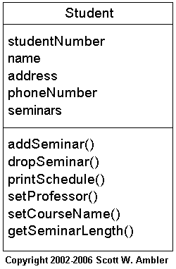
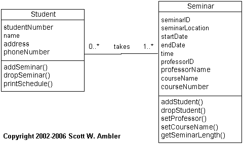

> 原文：<http://www.agiledata.org/essays/objectOrientation101.html>

この記事は、[Agile Database Techniques](http://www.ambysoft.com/agileDatabaseTechniques.html) Chapter 2をまとめたものである。

Java、C++、Object Pascal、C#、VBのようなプログラム言語の普及により、
オブジェクト指向技術が新規開発プロジェクトにおける選択肢となった。
COBOLやPL/1のような手続き型言語も、今後10年は残るだろうが、
多くの組織は保守を要するレガシー技術と見なしており、
いつか使うのをやめようとしている。
事態は進行しているのだ。

アジャイルソフトウェア開発者（アプリケーション開発者、アジャイルDBA）は、
オブジェクト指向の知識を最低限持っておくべきだろう。
これには、継承、多態性、オブジェクト永続化のような基本的な考えが含まれる。
さらに、すべての開発者は業界標準のUMLの基礎知識も持っておくべきだろう。
手始めに、基本的なUML図から始めると良いだろう——
ユースケース図、シーケンス図、そしてクラス図だ。
イントロダクションで述べたが、アジャイルモデリングやアジャイルドキュメンテーションを行うには、さらにモデリングを学習する必要がある。

他のIT技術者と一緒に働く利点のひとつは、
彼らから新たなスキルを学べるという点である。
オブジェクト指向技術者の多くは、他の分野の基本概念を学ぶことができるだろう。
例えば、クラス正規化がある（データ正規化のオブジェクトバージョン。結合度を下げるためのシンプルなルールであり、オブジェクト間の凝集性を高める）。

この章では、アプリケーション開発者がオブジェクト技術を使って日常的に行っている基本的な概念や技術の概要について述べる。
ここでは、オブジェクトパラダイムの基本を理解しようとしているアジャイルDBAを対象としている。アプリケーション開発者がどのように考えているのか分かるようになるだろう。
この章の主目的は、アジャイルDBAに十分なオブジェクト技術の理解を与え、
アプリケーション開発者とコミュニケートできるようにすることである。
また、リレーショナルデータベース技術などの基本的なデータ技術の概念やデータモデリングについても述べる。
アプリケーション開発者は、アジャイルDBAがどのように考えているか分かるようになるだろう。

# 1. オブジェクト指向の考え方

アジャイルソフトウェア開発者（アジャイルDBAを含む）は、
オブジェクト指向の基本的な考え方に慣れておく必要がある。
オブジェクト指向（OO）のパラダイムは、
オブジェクトと呼ばれる再利用可能なコンポーネントを使って、
システムを構築するという考えに基づいた開発戦略である。
従来の構造化手法のようにデータと機能を分けるのではなく、
オブジェクトにデータと機能を格納する。
本書において、オブジェクト指向パラダイムが構造化したパラダイムと似ているように思えるかもしれないが、両者は全く異なる。 
経験を積んだ開発者がよく間違いを犯す。
同様のソフトウェア工学の原則を適用しているだけで、
ずっと「オブジェクト思考を使っている」と思ってしまうのだ。
成功するには、OO手法が構造化手法と異なることを認識する必要がある。

OOを理解するにはOOの用語を理解する必要がある。
重大な用語を表1にまとめておいた。
用語についての詳細は『Object Primer 3rd Edition』に著している。
以前見たことある用語もあるだろう。見たことがない用語もあるだろう。
カプセル化、結合、凝集性などといった多くのOOの概念は、ソフトウェア工学からきている。
これらの概念はOO設計を補強するためのもので、非常に重要である。 
ここでのポイントは、考え違いをしないことである。
以前に見たことがあるからといって、それでオブジェクト指向を行っていたとは言えない。
それは、よい設計を行っていたということに過ぎない。
よい設計はオブジェクト指向の大きな部分を占めてはいるが、
まだほかにも存在する。

*表 1 オブジェクト指向の用語*

|用語|説明|
|:----|:----|
|抽象クラス|インスタンス化されないクラス |
|抽象化|モノの本質的な性質の識別|
|集約|2つのクラスあるいはコンポーネントの「部分（is part of）」あるいは「包含（contains）」の関係を表す。|
|集約階層|集約で関連づけられた1セットのクラス |
|関連|オブジェクトは他のオブジェクトと関係がある(関連がある)。 |
|属性|クラスが知っているもの(データや情報など)|
|クラス|同様のオブジェクトをソフトウェア的に抽象化したもの。オブジェクト作成用のテンプレート。 |
|凝集性|カプセル化されたユニット(コンポーネントやクラスなど)の関連性の程度|
|協調|クラスは、責任を果たすために相互に協調して働く。|
|合成| 集約の強化版で、「全体」が部分に対して完全に責任を持ち、各「部分」オブジェクトはただ1つの「全体」オブジェクトに関連付けられる。|
|具象クラス|オブジェクトをインスタンス化できるクラス |
|結合|2つのアイテム間の依存度 |
|カプセル化|関連する概念を、クラスやコンポーネントのような1つのアイテムでグループ化すること。|
|情報隠蔽|属性への外部アクセスの制限 |
|継承 |「is a」「is like」「is kind of」の関係を表す。クラス「B」がクラス「A」を継承すると、「B」は自動的に「A」が実装した（または他のクラスから継承した）属性およびオペレーションをすべて持つことになる。|
|継承階層|継承で関連づけられた1セットのクラス |
|インスタンス|クラスをインスタンス化したオブジェクト|
|インスタンス化|クラスからオブジェクトをインスタンス化（作成）する。|
|インターフェース|オペレーション シグニチャの集まりを定義したもの。|
|メッセージ|メッセージとは、情報のリクエストまたはアクションのリクエストのことを指す。|
|メッセージング|協調するために、クラスが他のクラスにメッセージを送ること。|
|多重継承|クラスが複数のクラスを継承すること|
|多重度|データモデリングの概念である「基数」と「optionality」を合わせたUMLの概念|
|オブジェクト|人、場所、もの、出来事、概念、画面、あるいはレポート|
|オブジェクト スペース|メイン メモリとネットワーク上の利用可能なストレージ領域（リレーショナルデータベースのような永続化機構も含む）|
|オペレーション|クラスが行うこと(構造化プログラミングの「機能」と似ている)|
|オーバーライド|サブクラスで属性やメソッドをオーバーライド(再定義)することがある。|
|パターン|よくある問題への再使用可能なソリューション。関連したフォースを考慮に入れている。|
|永続化|オブジェクトがどのように永久的に格納されるか|
|永続化オブジェクト|永久記録媒体に保存されるオブジェクト |
|多態性|オブジェクトごとに異なる方法で同じメッセージに応答することができる。オブジェクトは相手の正確な型を知らずに、互いに対話することができる。 |
|単一継承|クラスが一つのクラスを継承する|
|ステレオタイプ|モデリング要素の一般的使い方を表す。|
|サブクラス|クラス「B」がクラスを「A」を継承する場合、「B」は「A」のサブクラスであると言う。 |
|スーパークラス|クラス「B」がクラスを「A」を継承する場合、「A」は「B」のスーパークラスであると言う。 |
|一時オブジェクト|永久記録媒体に保存されないオブジェクト |

アジャイルDBAにとって、表1で示した用語の理解は重要である。
一緒に働くアプリケーション開発者がこれらの用語を日常的に使用するためだ。
アプリケーション開発者とうまくコミュニケートするためには、これらの用語を理解しなければならない。また、自分たちの用語も理解しなければならない。 
オブジェクト指向の基本を学習するには、他にもUMLの各ダイアグラムを理解する必要がある。
UMLのエキスパートになる必要はない。しかし、基本は学習する必要がある。 

# 3. クラス正規化

データベースの世界では「データ正規化」と呼ばれるプロセスがある。
一定の手順でデータを整理し、データの冗長性を減らしたり、排除したりすることで、
効果的にデータエンティティの凝集性を高めるプロセスだ。
データ正規化の手法をオブジェクトスキーマにも適用できるだろうか？ もちろんだ。
ただし、そのまま適用できるというわけではない。
データ正規化はデータを対象にしており、振る舞いを扱わないからだ。
オブジェクトスキーマを正規化するときは、データと振る舞いを考慮に入れる必要がある。
この点について改めて考える必要があるだろう。
クラス正規化とは、クラス間の結合度を下げながら、凝集性を高め、
オブジェクトスキーマの構造を再構成するプロセスである。

残念なことに、クラス正規化は私が思うほど広く使われているものではない。
これにはいくつかの理由があるが、
なかでもデザインパターンの存在により
クラス正規化の影が薄くなったというのが大きいだろう。
デザインパターンとは、あるコンテキストのなかで発生する問題の解法を記述しているものだが、これはこれで確かに優れたものである。
しかし、クラス正規化とはまた別の補完的な手法である。
クラス正規化デザインパターンに比べて有用なのは、
その考え方がデータ専門家にも分かりやすく、
オブジェクト技術の習得の手助けにもなるという点だ（少なくとも私はそうだった）。

『[Building Object Applications That Work](http://www.ambysoft.com/buildingObjectApplications.html)』で私は、 
3つのクラス正規形について述べた。

- 第一オブジェクト正規形(1ONF) 
- 第ニオブジェクト正規形(2ONF) 
- 第三オブジェクト正規形(3ONF) 

## 3.1 第一オブジェクト正規形(1ONF)

よく似た属性のコレクションが必要とする振る舞いがクラスにカプセル化されている場合、
そのクラスは第一オブジェクト正規形(1ONF)と呼ばれる。
すべてのクラスが1ONFのとき、オブジェク トスキーマは1ONFである。

図9にあるStudentクラスを考えてみよう。
StudentにSeminarを追加／削除する振る舞いが実装されている。
``seminars``属性はseminar情報のコレクションである（配列などで実装される）。
この属性は、Studentにどのseminarが割り当てられたかを記録するために使われる。
addSeminar()はStudentに新しくSeminarを登録し、dropSeminar()はStudentからSeminarを削除する。setProfessor()とsetCourseName()はseminarコレクションに含まれるデータを変更する。この設計では、凝集性が低い。単一のクラスに複数の概念の機能が実装されている。

*図9. 第0オブジェクト正規形のStudentクラス*

図10は、第一オブジェクト正規形を表してる。
Seminarクラスが導入され、seminarがいつ、どこで、誰が、何のコースを行うかを管理するために必要なデータ、機能が実装されている。
seminarにstudnetを追加／削除する機能も実装されている。
Seminarクラスの振る舞いをカプセル化することで、
凝集性を高めている。
Studentクラスではstudentが行うこと、
Seminarクラスではseminarの型が定義されている。
図9のスキーマでは、Studentクラスがこの両方のことが行われていた。

*図 10 第1オブジェクト形のStudentクラス*

1ONFはデータの第一正規形(1NF)に対応している。
1NFでは、エンティティからデータの繰り返し項目を削除する。
1ONFでは、クラスから振る舞いの繰り返し項目を削除する。
