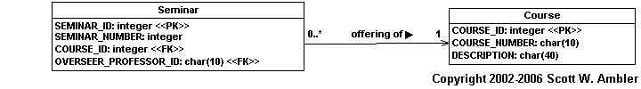
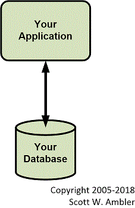
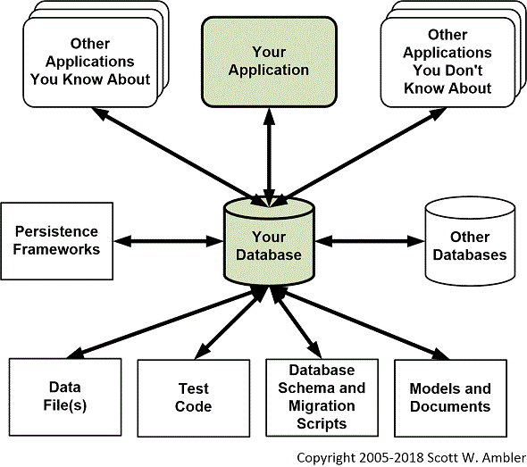
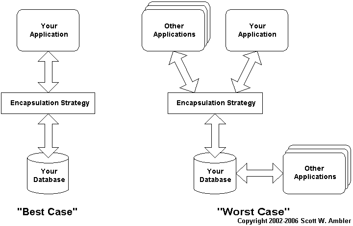

> 原文：<http://www.agiledata.org/essays/relationalDatabases.html>

※ 正確なタイトルは「リレーショナルデータベース基礎: 全体像を視野に入れる」です。

この記事は、[Agile Database Techniques](http://www.ambysoft.com/agileDatabaseTechniques.html) Chapter 6より抜粋。

議論を始める前に。リレーショナルデータベースとは、データをストアしたり、場合によっては機能を実装することもできる永続化機構である。
この章の目標は、
リレーショナルデータベース（RDB）技術の概観をつかむこと。
そして、現代組織におけるリレーショナルデータベースの適用について掘り下げていくことである。
RDBはアプリケーションで必要となる情報をストアするために使用される。
アプリケーションとは、COBOLやFORTRANといった手続き型技術、JavaやC#といったオブジェクト指向技術、Visual Basicなどのコンポーネントベース技術を用いて構築される。
RDBは有力な永続化技術であるため、すべてのIT専門家は少なくともRDBの基礎、RDBの課題、いつRDBを使えばよいか、くらいは理解しておく必要がある。

# 1. アジャイルDBAの役割
RDBに関して言うと、アジャイルDBAの役割とは、以下のようなものである。

- RDBの基礎について理解すること。基本的な管理技術（データベースのインストール、パフォーマンスチューニング、バックアップ、それからアーカイヴ）を含む。『[Database Administration: The Complete Guide to Practices and Procedures](http://www.amazon.com/exec/obidos/ASIN/0201741296/ambysoftinc)』Craig Mullins 著(2002)という良書がある。
- RDBの長所、短所を理解すること。RDB以外の選択肢があることを認識すること。
- アプリケーションプログラマと共に働き、あなたが選んだデータストレージ技術について指導すること。

# 2. リレーショナルデータベース技術
用語の定義から始めよう。
リレーショナルデータベースは、テーブルの内にデータをストアする。
テーブルは列（カラム）から成り立っており、
列には1つのデータ型（整数、実数、文字列、日付など）がストアされる。
テーブルの「インスタンス」は、行（ロウ）としてストアされる。
たとえば、Customerテーブルは、``CustomerNumber``、``FirstName``、``Surname``といった列を持っており、行は ``'{1701, “James”, “Kirk”}``' といった形になる。

テーブルにはたいていキー（テーブルの行をユニークにする複数の列）がある。
Customerテーブルの場合、``CustomerNumber``がキーとなる。
データへのアクセス時間を向上するには、テーブルにインデックスを定義する。
インデックスを定義すると、手軽に、ある列のデータの検索を早くすることができる。
本の索引（インデックス）を使うと情報の検索が早くなるのと一緒である。

以上の基本的な用語を理解すれば、アプリケーション開発者は簡単な用途に限りリレーショナルデータベースを使用することが出来るだろう。


## 2.1 リレーショナルデータベースの機能
リレーショナルデータベースでよく使うのは、簡単なCRUD（Create, Read, Update, Delete）機能だろう。
たとえば、アプリケーションで新しい注文を作って、
データベースにINSERTする。
データベース内に存在する注文をREADすることもできる。
新しい情報にUPDATEすることもできる。
顧客がキャンセルしたときなどは、注文をDELETEすることもできる。
RDBとのやりとりの大半は、基本的なCRUD機能で間に合うだろう。

データベースを操作する最も簡単な方法は、標準クエリ言語（SQL）を発行することだ。
図1に簡単なデータモデルを示している（[データモデリング基礎](DataModeling101)、[データモデリング用UMLプロファイル（非公式版）](AnUnofficialUMLProfileforDataModeling)を参照のこと）。
Seminarテーブルに行を作成するには、
コード1で示すように、INSERT文を発行する。
同じように、コード2では、
SELECT文を発行して行を読み出す方法を示している。
コード3では、UPDATE文を使って存在する行を更新している。
コード4では、DELETE文を使って行を削除している。
これら4つの例とデータモデルは、拙著『[The Object Primer 2/e](http://www.ambysoft.com/theObjectPrimer.html)』から引用した。
SQLを勉強するには、Micheal J. HernandezとJohn L. Viescasによる『[SQL Queries for Mere Mortals](http://www.amazon.com/exec/obidos/ASIN/0201433362/ambysoftinc) 』(Addison Wesley, 2000)が良い。

*コード 1. INSERT文: "Seminar"テーブルへの追加*

```sql
INSERT INTO Seminar
(SEMINAR_ID, COURSE_ID, OVERSEER_ID, SEMINAR_NUMBER)
VALUES (74656, 1234, ‘THX0001138’, 2)
```

*コード 2. SELECT文: "Seminar"テーブルからのデータの読み取り*

```sql
SELECT * FROM Seminar
WHERE SEMINAR_ID = 1701
```

*コード 3. UPDATE文: "Seminar"テーブル内のデータの更新*

```sql
UPDATE Seminar
SET OVERSEER_ID = ‘NCC0001701’, SEMINAR_NUMBER = 3
WHERE SEMINAR_ID = 1701
```

*コード 4. DELETE文: "Seminar"テーブル内のデータの削除*

```sql
DELETE FROM Seminar
WHERE SEMINAR_ID > 1701
AND OVERSEER_ID = ‘THX0001138’
```


*図 1. 簡単なデータモデル（UML表記）*



## 2.2 リレーショナルデータベースの拡張機能
1. **オブジェクトストレージ。**オブジェクトをリレーショナルデータベースに保存するには、オブジェクトをフラットにする必要がある。リレーショナルデータベースにはデータしか保存できないからだ。オブジェクトを取り出すには、データベースからデータを読み取り、そのデータを基にオブジェクトを作ることになる（オブジェクトのリストアと呼ばれる）。オブジェクトをリレーショナルデータベースに保存するのは簡単なことのようだが、実際はとても難しい。これは、リレーショナルデータベース技術とオブジェクト技術はそれぞれ異なる理論に基づいているために起こるオブジェクト—リレーショナルインピーダンスミスマッチが原因である。これについては[オブジェクト・リレーショナル・インピーダンス・ミスマッチ](TheObject-RelationalImpedanceMismatch)で詳しく述べた。オブジェクトをリレーショナルデータベースに正しく保存するには、[オブジェクトスキーマをリレーショナルデータベーススキーマにマッピングする方法](Mapping101)を学ぶ必要がある。
1. **データベースに振る舞いを実装。**リレーショナルデータベースの振る舞いは、ストアドプロシージャやストアドファンクションを使って実装する。それらはデータベース内で呼び出されることもあるが、通常、外部アプリケーションから呼び出される。ストアドファンクションやストアドプロシージャは共にRDBの中で実行される操作であるが、両者の違いは、操作に戻り値があるかないか、また、クエリの中で実行できるかどうかである。この違いはここではそれほど重要ではないため、「ストアドプロシージャ」という言葉を使って両者を表す。かつてストアドプロシージャは、Oracle PL/SQLなどのプロプライエタリな言語で記述されていたが、今では、Javaが急速にデータベースプログラミング言語の選択肢となった。ストアドプロシージャは通常、SQLコードを実行したり、データを管理したりすることができる。そして、0以上のレコードやレスポンスコード、および、データベースエラーメッセージを返す。ストアドプロシージャの効果的な使用方法は、[RDBでオブジェクトを永続化する方法](EncapsulatingDatabaseAccess)で述べる。
1. **並行処理制御。**航空券予約システムを考えてみよう。座席が1つ残っており、2人の人間が同時に予約しようとしている。2人とも予約状況を確認し、「席は空いています」と告げられた。2人とも同時に支払い情報を入力し、予約ボタンをクリックした。さて、何が起きればよいのだろうか？システムが正常に動いていれば、1人の人間が席を確保でき、もう1人の人間は席を確保できないはずだ。[並行処理制御](ImplementingConcurrencyControl)とは、このようなことを指す。並行処理制御はオブジェクトソースコードとデータベース内で実装されなければならない。
1. **トランザクション制御。**トランザクションとは、データのセーブ、読み出し、削除などのデータベース上の一連のアクションであり、ひとつの作業単位(work unit)である。通常、トランザクションとは「ALL or Nothing」である。すべてのアクションが成功するか、もしくは、すべてロールバック（キャンセル）されなければならない。ネストしたトランザクションは、それ自体がいくつかのアクションからなるトランザクションである。ネストしたサブトランザクションが正常にコミットされると、親トランザクションが失敗しても、ロールバックはされない。トランザクションは1000分の1秒のように短命(shot-lived)のものもあれば、1時間、1日、1週間、果ては1ヶ月のように長寿(long-lived)のものもある。[トランザクション制御](ImplementingConcurrencyControl)は、すべての開発者が理解すべき重要な概念である。
1. **参照整合性。**参照整合性(Referential integrity)とは、あるエンティティから他のエンティティへの関連がvalidであるかどうかを表すものである。例えば、CustomerがAddressを参照しているとする。このとき、そのAddressは事前に存在しなければならない。このAddressが削除されると、参照しているものはすべて削除されなければならない。もしくは、システム側でこのAddressの削除を認めてはならない。一般に考えられていることとは違い、参照整合性は単なるデータベースの問題ではない。これは、システム全体の問題である。CustomerはJavaアプリのオブジェクトとデータベース上の1つ（または複数）のレコードとして実装される。——Addressもオブジェクトとデータベース上の行で実装される。Addressを削除するには、メモリにあるAddressオブジェクト、Addressオブジェクトへの直接または間接的参照（Addressの主キーである``AddressID``を知っているCustomerオブジェクトが含まれる）、データベースにあるAddress行、Address行へのすべての参照（外部キー経由）を削除しなければならない。もしAddressオブジェクトが同時にいくつものアプリケーションサーバ群に存在していると、ことは厄介だ。さらに、他のアプリケーションがデータベースにアクセスしているとなると、そのアプリケーションのメモリ上にもAddressへの参照が残っている可能性があって厄介極まりない。もっと言うと、Adressがいろんな場所に保存されていると（異なるデータベースなど）、それらも考慮しなければならなくなる。すべての開発者は、[参照整合性における基本的な戦略](ImplementingReferentialIntegrityAndSharedBusinessLogic)について理解しなければならない。

表1は、リレーショナルデータベースの一般的な機能、
開発者がそれを使って何ができるか、
そして、考えられる欠点を示している。

*表1. RDBの一般的な機能*

|機能|考えられる使い方|考えられる欠点|
|:----|:----|:----|
|データベースカーソル—データベースカーソルはSQLクエリの結果を効果的に扱うためのものであり、これを使うと複数の結果(result set)を前方、後方に行き来することができる。|* 大量の結果でも少しずつアクセスすれば、アプリケーションは最初の結果を早めに表示することができ、レスポンスタイムを縮めることが出来る。<br/>* 必要な結果が少なければ、ネットワーク上を流れるデータも少なくてすむため、パフォーマンスが向上する。|* カーソルでレコードにアクセスすると、元のデータが変更されてしまう可能性があることをアプリケーション開発者は理解しておく必要がある。例えば、前もって取り出したデータが消されてしまったり、取り出した結果の一部に新たなデータが挿入されたり、取り出したレコードが更新されたりする。<br/>* すべてのカーソルが同じではなく、前方スクロールのみ可能なカーソルもある。<br/>* カーソルはメモリインテンシブなため、データベースのリソースを食う。|
|Java—ほとんどのデータベースベンダーが、データベース内でJava VMをサポートしている。|* 比較的プラットフォームから独立したデータベースの振る舞いの開発。<br/>* データインテンシブな振る舞いの開発はあまり見返りがない。<br/>* データベースアクセスのカプセル化は、情報へのセキュリティアクセス制御となる。<br/>* 多くのアプリケーションで共通する振る舞いの開発。|* アプリケーションサーバとデータベースサーバのVMのバージョンが異なると、開発が複雑になる。<br/>* データベース内に実装された振る舞いは、ボトルネックとなりやすい。|
|トリガー—トリガーはあるアクション（create, update, deleteなど）の前後で実行されるプロシージャであり、データベーステーブルの行で実行される。|* データベース内の参照整合性を強制する。こういったタイプのトリガは、データベースモデリングツールやデータベース管理ツールなどで自動的に生成される。<br/>* 参照整合性を実装する最小公分母が制約となる★<br/>* 手作りログチェック|* 手作り（手作業）トリガーは、メンテナンスが難しく、データベースベンダーへの依存度が高くなる。<br/>* トリガーはたいていプロプライエタリな言語で実装されるため、チームにとって余分なスキルが必要となる。<br/>* トリガーは自動的に読み出されるため、危険な場合もある（連なった削除トリガーによる「コントロール不能」な削除のカスケードなど）。<br/>* データベースがうまくスケール★されていないと、データベース内に実装された振る舞いがボトルネックとなりやすい。|


# 3. 結合: 最大の敵
結合は、2つのものがどれだけ依存しているかの指標である——両者の結びつきが深ければ深いほど、一方を変更したときにもう一方を変更する可能性が高くなる。
結合は、ソフトウェア開発における「諸悪の根源」である。
データベーススキーマとの結びつきが多ければ、
それだけメンテナンスや拡張は困難となる。
リレーショナルデータベーススキーマは、以下のようなものと結合する。

1. **あなたのアプリケーションソースコード。**データベーススキーマを変更すると、そのスキーマにアクセスしているアプリケーションソースコードも変更しなくてはならない。図2は、あなたのアプリケーションコードだけがデータベーススキーマと結合しているという最良のシナリオを示している。この状況は昔から「ストーブパイプ」と呼ばれる。これは今も存在しており、よく「スタンドアローンアプリケーション」や「ストーブパイプシステム」、または、「グリーンフィールドプロジェクト（新設プロジェクト）」などと呼ばれる。もしあなたがこういう状況にあるなら、それはラッキーと思っていい。実際にはこんなこと滅多にないことだから。
1. **他のアプリケーションソースコード。**図3はリレーショナルデータベースにおける最悪のシナリオを示している。様々なソフトウェアシステムがデータベーススキーマに結合している。既存のデータベースではよくあることだ。チームが現在携わっているアプリケーション以外にも、あなたのデータベースに結合しているアプリケーションがあるというのは（知っている知らないを問わず）よくあることだ。オンラインシステムがデータベースを読み書きをしているのかもしれない。マネージャがあなたの知らないところでスプレットシートを書いていて、あなたのデータベースからデータを読み取っているのかもしれない。彼女は仕事に必要な情報を要約するためにそれを使っているのだ。
1. **読み取ったデータ。**政府発行の税額表やあなたのテストデータなど、他のソースからロードしたデータはデータベーススキーマとしばしば結合される。
1. **抽出したデータ。**データベースからデータを読み取るデータ抽出スクリプト（プログラム）があるかもしれない。XMLデータファイルが作成され、他のデータベースに取り込まれることもある。
1. **永続化フレームワーク（レイヤー）。**永続化フレームワークはアプリケーションのクラスと永続化ストレージソース（データベースなど）とのマッピングロジックをカプセル化する。データベーススキーマをリファクタリングすると、マッピング情報を記述したメタデータやソースコードもアップデートしなければならないだろう。
1. **それ自体。**データベース内にも結合が存在する。ある列のことを、ストアドプロシージャが参照していたり、他のテーブルが外部キーで参照していたり、ビューが参照していたりして結合している。ちょっとした変更がデータベースの至る所で変更を招くことになる。
1. **データ移行スクリプト。**データベーススキーマを変更すると、データ移行スクリプトも変更しなくてはならない。
1. **テストコード。**テストコードとは、データベースにある状態にしたり、データベースに影響するトランザクションを実行したり、データベースから結果を読み取って期待値と比べたりするものを含む。データベーススキーマを変更したら、テストコードも変更しなければならないことは明らかだ。
1. **ドキュメント。**物理データスキーマに関する重要なドキュメント。物理データモデルに限らないものや記述データも含める。データベーススキーマを変更すると、ドキュメント（説明書）もそれに従って変更する必要がある。アジャイルモデリングでは、ドキュメントは必ずしも常に完璧にデータスキーマと同期している必要はない。「[困ったときだけ更新しよう](http://www.ogis-swe.jp/process/am-res/am/practices.html#UpdateOnlyWhenItHurts)」と言っているが、実際にはドキュメントを更新しなければならない場面もでてくるだろう。

このように結合は、リレーショナルデータベースにおける深刻な問題である。
おまけに結合の概念は、データベースの理論の範疇から外れている。
多くのデータベース理論の本はデータ正規化についてイヤになるほど詳細に記述してあるが、
[データモデリング基礎](DataModeling101)で私は、
正規化はデータコミュニティでの凝集性の扱い方であると述べた。
私の経験では、
結合が深刻な問題となるのは、
コードなど、振る舞いから考え始めた場合のみであり、
伝統的なデータベース理論では振る舞いは扱わない。
これについては、[Agile Modeling (AM)](AnIntroductionToAgileModeling)の[複数のモデル](http://www.ogis-swe.jp/process/am-res/am/principles.htm#MultipleModels)原則とbeyond data([Ambler 2002a](http://www.ambysoft.com/agileModeling.html))を参照のこと★。

*図 2. 最良のシナリオ*



*図 3. 最悪のシナリオ*




# 4. リレーショナルデータベースのさらなる課題

結合は確かに重要だが、
結合だけがリレーショナルデータベースの課題ではない。
他にも以下のような問題に直面するだろう。

1. **パフォーマンス問題は予測しにくい。**図3で示したような共有データベースを使っている場合、データベースのパフォーマンス問題は予測しにくい。なぜなら、各アプリケーションが独自の方法でデータベースにアクセスしているからだ。例えば、あるレガシーアプリケーションが販売商品に関する情報を月に何度も更新することがあると思う。オペレータが新しい品目を追加したり、既存の品目を更新したりしているわけだ。このとき、他のアプリケーションのパフォーマンスはそれほど影響を受けない。しかし、このアプリケーションがパートナー企業から販売可能な品目をバッチで読み込んだらどうだろう。できるだけ早くこれらの品目をWebサイトに公開したいが、「商品」テーブルの読み込みが重く、バッチでの読み込みに数分かかることもある。こうなるとオンラインアプリケーションにも影響を及ぼす可能性もある。
1. **共有データベースではデータの整合性を保証しにくい。**データを制御しているのはひとつのアプリケーションではない。そのため、すべてのアプリケーションが同一のビジネスルールに従って動作している保証はない。例えば、あなたのアプリケーションでは、出荷が完了し、代金を受け取った時点で注文が完了すると見なしているかもしれないが、現在も電話注文時に使われるオリジナルレガシーアプリケーションでは、出荷が完了し、代金を受け取り、代金を口座に入金した時点で注文が完了すると見なしているかもしれない。わずかなビジネスルールの違いが、共有データベースにアクセスするすべてのアプリケーションにとって深厚な問題となるのだ。たとえば、こんな状況を考えてみると明らかだろう。オンライン注文受付アプリケーションが注文合計を計算し、注文テーブルに保存する。だが一方、レガシーアプリケーションは、小計は計算するが注文合計は計算しない。この場合、何が起こるだろうか。注文合計がすでにあればその数字を使えばいいだけなのだが、注文一括処理アプリケーションは注文合計がないと思い、合計を計算し、税金を加算してしまう。顧客がオンラインで注文を行い、数時間後にコールバックして、先ほどの注文を修正するよう顧客サービス係に頼むとする（品目をいくつか追加するのだろう）。すると、注文合計はもはや現在のものではなくなる。正しく更新されていないからだ。このような参照整合性問題については、[参照整合性](ImplementingReferentialIntegrityAndSharedBusinessLogic)の章で扱う。
1. **オペレーション用データベースには、レポート用データベースとは異なる設計戦略が必要。**オペレーション用データベースのスキーマは、それにアクセスするアプリケーションの運用上の必要性を反映している。結果として、一部パフォーマンスのために非正規化された「合理的に」[正規化](DataModeling101)されたスキーマとなる。一方、レポート用データベースは、通常、激しく[非正規化](DataModeling101)を行い、データを冗長化させて、様々なレポート形式に対応している。

どんな技術にも長所と短所があり、
リレーショナルデータベース技術もその例外ではない。
幸いにもこれらの課題を緩和する道がある。
カプセル化はそんな重要な技術である。

# 5. カプセル化: 最大の味方

カプセル化とは、システム内の機能をいかに区分けするかという設計事項である。
ある機能を使うために、それがどのように実装されているかを知らなくてもよい。
カプセル化されていれば、いかようにも実装可能である。
他のコンポーネントに影響を与えないのであれば（コンポーネントに対するインターフェースが変更されない限り）、後から実装を変更することもできる。
よく、カプセル化は箱を黒く塗る作業だといわれる——何が行われるかを定義はするが、どのように行うかは外部に伝えない。
例えば銀行業務を考えてみよう。銀行は口座管理をどのように行っているのだろうか。
メインフレームを使っている？ミニコンピュータを使っている？それともPCを使っている？データベースは何を使っている？OSは何？そんなこと、あなたには関係ない。銀行は口座管理サービスをカプセル化しているからである。あなたは窓口へ行き、希望する取引を伝えればいい。

データベースへのアクセスをカプセル化することにより
（おそらく、データアクセスオブジェクトのように簡単な何かを経由するか、
永続化フレームワークのような複雑な何かを使うかになるだろう）
使用するデータベースとの結合度を下げることができる。
[オブジェクトをRDBに永続化する方法](EncapsulatingDatabaseAccess)という章で様々なカプセル化戦略の比較を行うが、とりあえず今は、データベーススキーマの詳細を隠しつつ、データベースにアクセスさせることが可能だということを覚えておこう。
ただし、データベースをサポートする責任のあるAgile DBAはカプセル化戦略を保守／発展させるため、裏にあるデータベーススキーマについても理解し、扱っていかなければならない。

データベースアクセスへのカプセル化の利点のひとつは、
アプリケーションプログラマがビジネスロジックにフォーカスしていれば良いという点だ。
データベーススキーマにアクセスするSQLコードを持つデータベースアクセスオブジェクトのような簡単なものを想定してみよう。
アプリケーションプログラマはデータベースではなく、このようなデータアクセスクラスに対して作業を行えばよい。
Agile DBAは、必要ならば[データベースリファクタング](TheProcessOfDatabaseRefactoring)などを使い、データベーススキーマを改良することができる。後はデータベースアクセスクラスを更新しさえすればよい。
こうなると、もうひとつの利点が浮かんでくる——Agile DBA はもっと自由に仕事ができるようになるのだ。

図4はデータベースアクセスのカプセル化の概念を表している。
図2の最良のシナリオと図3の最悪のシナリオは、このようになるだろう。

最良のシナリオでは、ビジネスロジックのコードは、代わりにデータベースとやり取りをしてくれるデータアクセスオブジェクトとやり取りをしている。
第一の利点は、データを扱うコードが一箇所に集められること。
こうすると、データベースのスキーマが変更されても、
パフォーマンスのための改善変更をするにも、修正が簡単だ。
アプリケーションプログラマが書いているビジネスロジックコードは、
このときもデータアクセスオブジェクトとやり取りを行っているのだから面白い。
つまり、データアクセスオブジェクトのインターフェースが変更されると、
コードも変更する必要がある。
結合（カップリング）からは決して逃れられない。
しかし、アプリケーションプログラマの立場からすると、
このほうが発見も対処もしやすいのである——データベースカプセル化戦略がうまくいけば、アプリケーションプログラマはソースコード＋SQLではなく、ソースコードだけを扱えばよい（例えばJavaなど）。


*図 4. 改訂されたシナリオ*



最悪のシナリオに備えられるほど楽観視はできない。
すべてのアプリケーションがあなたのカプセル化戦略を利用するという可能性がないわけでもないが、実際には一部のアプリケーションだけが利用するにとどまるだろう。
プラットフォームの非互換性が問題である。
おそらくあなたのデータアクセスオブジェクトはJavaで書かれているのだろう。
しかし、レガシーアプリケーションのなかにはJavaに簡単にアクセスできないような技術で書かれたものもある。
あなたは、レガシーアプリケーションを作り直さずに
データベースカプセル化戦略を採用しようと決めたのかもしれない。
すでにカプセル化戦略を採用してるアプリケーションがあるかもしれない
（その場合、新たに構築するのではなく、既存のものを再利用するようにしよう）。
データベーススキーマに直接アクセスしなければならないような技術を使いたいこともあるかもしれない（例えばbulk loadとか）。
ここでのポイントは、つまり、組織内のアプリケーションには、
あなたのカプセル化戦略によってメリットを得るものもあれば、
そうでないものもあるということだ。
しかしまだカプセル化を行うメリットは残っている。
結合度を低下させれば、開発コストも低下し、保守作業も減る。
問題はメリットがしっかりと認識できないという点だ。

他にも、データベースへのアクセスをカプセル化することにより、
データベースとは別に、データ中心のビジネスルールを実装するための
「共有地」が手に入るというメリットがある。


# 6. リレーショナルデータベースを超えて: あなたには選択権がある
リレーショナルデータベース技術にはいくつかの明らかな問題があるため、
他の技術を使わなければならないこともあるだろう。
もちろん、RDBは現在最も使用されている永続化機構だ。
しかし、選択肢はそれだけじゃない。
他にも以下ような選択肢がある：

1. **オブジェクト／リレーショナルデータベース。**オブジェクト／リレーショナルデータベース（ORDBs）は、オブジェクトをリレーショナルデータベースに保存する（オブジェクト／リレーショナルデータベースマネジメントシステム（ORDBMSs）としても知られる）。ORDBsには、伝統的なフィールド・データ、時系列や空間的なデータのような複雑なオブジェクト、オーディオ、ビデオ、画像（時には）Javaアプレットなどの様々なバイナリメディアを統合する新しい機能が追加されている。ORDBsは基本的に、データ型の定義などRDBsの機能に追加がなされている。例えば、``'SurfaceAddress``'という型が定義できる。この型には、addressのすべての属性と振る舞いが含まれている。また、テーブルを結合するというRDBの機能に加え、オブジェクトをナビゲートするという機能も備えている。データベース内にオブジェクトを実装すれば、ORDBは複雑な分析やデータ操作が実行可能となり、マルチメディアやその他の複雑なオブジェクトを検索したり、変換したりすることができる。ORDBsはRDBsの堅牢なトランザクションとデータ管理機能を備えている。同時に、オブジェクト指向データベースの柔軟な機能も一部備えている。ORDBsはリレーショナル技術を基にしているため、データベース管理者は使い慣れた表形式やDDLを扱うことができる。プログラマは使い慣れたSQL3、JDBC、プロプライエタリなコールインターフェースを使ってアクセスすることができる。
1. **オブジェクトデータベース。**オブジェクトデータベース(ODBs)は、オブジェクト指向データベース(OODBs)またはオブジェクト指向データベースマネジメントシステム(OODBMSs)としても知られ、ほぼシームレスにデータベース機能および永続化機能をオブジェクト指向言語に付加できる。成熟したオブジェクトをデータベース内に格納できるともいえる。プログラム言語のオブジェクトを格納するだけではない。OODBsは、Javaのセマンティクスを拡張したフル機能のデータベース言語を備えている。ネイティヴ言語との互換性を保ちながら、ODBベンダーに特化した新しいクラスライブラリを提供しているのだ。主な利点は、アプリケーション開発とデータベース開発をシームレスなモデルに統合できることである。結果として、アプリケーションに必要なコードは少なくなり、永続化モデルはより自然になり、コードの保守はしやすくなる。オブジェクト指向開発者は、完全なデータベースアプリケーションを適量の作業で作成することができる。オブジェクトをマーシャルして平べったいデータストラクチャーにして格納なんてしなくてもよい。その結果、その他の永続化技術（RDBなど）にあるマーシャルのためのオーバーヘッドが無くなる。このアプリケーションオブジェクトとデータベースオブジェクトとの one-to-one マッピングでは、オブジェクトの高度なパフォーマンスマネジメントが行え、オブジェクト間の複雑な相互関係をうまく管理できるようになる。
1. **ネイティヴXMLデータベース。**ネイティヴXMLデータベースは、情報をXMLドキュメントとして以下の2つの方法で格納する。1つ目は、XMLドキュメントを変形させてファイルシステムに格納する方法（圧縮したり、プリコンパイルした形で格納される）。2つ目は、ドキュメントの構造をデータベースにマッピングする方法である。例えば、ドキュメントオブジェクトモデル（DOM）を内部のElement、Attribute、およびTextに割り当てたりする（何をマッピングするかはデータベースによる）。アプリケーション開発者の視点から見た両者の重要な違いは、アクセスの方法の違いである。1つ目の方法では、データのインターフェースはXPathやDOMなどのXMLに関連する技術のみである（XPathとはXMLドキュメントの位置を指し示すための言語。詳細は [www.w3.org](http://www.w3.org/) を参照のこと）。一方、2つ目の方法では、JDBCのような標準的な方法でアクセスできる。ネイティヴXMLデータベースを理解する上で重要なことは、ネイティヴXMLデータベースはXMLドキュメントの内部構造を扱っている点である。単にバイナリラージオブジェクト（BLOB）でデータベースに格納しているわけではない。
1. **フラットファイル。**フラットファイル（.TXTや.CSVファイル）は、よく使われるファイルの保存方法である。ひとつのファイルには、ひとつのデータ構造を保存することができる（例えば、顧客情報や売買取引情報）。コーディングや整形をすれば、複数のデータ構造を保存することもできる。フラットファイルにするには、カンマやタブ、XMLドキュメントの ``'</FirstName>``' などで区切る方法がある。他にも、データのサイズで区切る方法もある。最初の20文字は顧客の名前、次の20文字はサーネイムなど。
1. **階層型データベース。**階層型データベースでは、データ構造は家系図のようにリンクされる。各レコードタイプはただひとつの親を持つ。たとえば、「注文」はただ一人の「顧客」に所有される。階層型データベースは、初期のメインフレームデータベースマネジメントシステムで広く用いられ、今もなお抱き行などではよく使われている。階層型データベースは、柔軟性がないためにリレーショナルデータベースにその座を奪われた。階層型データベースは、最初に設計されたデータ構造以外のデータアクセスをサポートしないからだ。例えば、「顧客—注文」というスキーマがある場合、「顧客」を経由しないと「注文」にアクセスできない。売上データを持つすべての「注文」を検索することが簡単にはできない。なぜなら、そのように設計されていないからだ。
1. **Prevalence layer。**Klaus Wuestefeldが「Prevalance layer」こう定義している「情報システムのビジネスロジックを実行する際の、ステートスナップショット、コマンド、クエリキューイング、ログインを使った、透過的永続化、フォールトトレランス、ロードバランシング」prevalence layerは、オブジェクトをシリアライズし、ログファイルに書き出すシンプルかつ有用な永続化フレームワークである。すべてのオブジェクトはメモリにキャッシュされ、オブジェクトの永続化はバックグラウンドで処理される。開発者は永続化を気にしなくともよい。

*Table 2. Comparing Types of Persistence Mechanisms.*

TODO

*Table 3. Potential Applications for Types of Persistence Mechanisms.*

TODO

# 7. 終わりに
リレーショナルデータベース技術は完璧ではない。完璧な技術などない。
リレーショナルデータベース技術の欠点について私がこんなにも筆を費やしているのは、
使っているものがどういったものなのかしっかりと理解することが重要だからである。
多くの著者がリレーショナルデータベースの長所について焦点をあてている。
たしかに多くの長所がある。しかし、欠点については触れられていない。
学術的な事項に焦点をあてる著者もいる。
例えば、E.F.コッド博士の12の機能を完璧に満たす「真のリレーショナルデータベース」はまだ存在しないとかなんとか（彼の後の論文にあるより良い機能には触れないくせに）。
こうした話題は、ビールを飲みながら語り合うには面白いだろう。
しかし私は、開発者が日々出くわすような、より実践的な話題に焦点をあてたい。

結合はすべてのIT専門家にとって深刻な問題である
（アプリケーション開発者もアジャイルDBAも含まれる）。
データベースアクセスのカプセル化は、結合問題を多少は解決してくれる。
しかしこれは部分的な解決策でしかない。
リレーショナルデータベースは永続化手法の選択肢のひとつであることを認識することも重要である。
非リレーショナル手法はある状況にのみ適応できる発展途中のソリューションであり、
よく考えて採用する必要があるだろう。
この本の残りの全体にわたって言いつづけたことは、
データを永続化するためには、
おそらくはリレーショナル技術を使うことになるだろうということである。


# 8. リファレンス

以下のエッセイが参考になるかもしれない。 

- [オブジェクトをリレーショナル・データベースにマッピングする](Mapping101)
- [データベースアクセスのカプセル化](EncapsulatingDatabaseAccess)

本書は、ソフトウェア開発者とデータベース管理者とが、
エクストリームプログラミング（XP）、
ラショナル統一プロセス（RUP）、
ユーザ機能駆動型開発（FDD）、
ダイナミックシステム開発メソッド（DSDM）、
エンタープライズ統一プロセス（EUP）といった
革新的なソフトウェア開発プロセスを適用したプロジェクトで、
「一緒に働く」ために必要な哲学とスキルを示している。

----

本書は、ソフトウェア開発における
フルライフサイクルなアジャイルモデル駆動開発（AMDD）手法を示している。
オブジェクト指向とデータ中心開発の両方をカバーし、
総合的かつ理論的に記した数少ない書籍である。
この本がカバーしている技術は、
アジャイルモデリング（AM）、
フルライフサイクルオブジェクト指向テスト（FLOOT）、
30以上のモデリング技術、
アジャイルデータベーステクニック、
リファクタリング、
テスト駆動開発（TDD）などである。
ミッションクリティカルなアプリケーションをアジャイル手法を使って構築するスキルを身に付けたいのであれば、この本しかないだろう。
