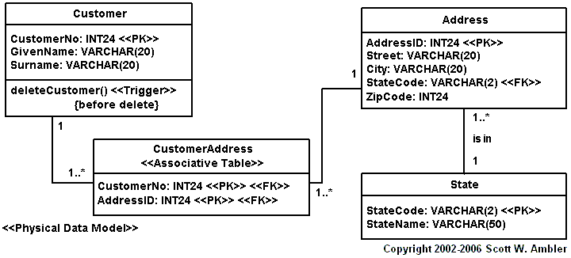
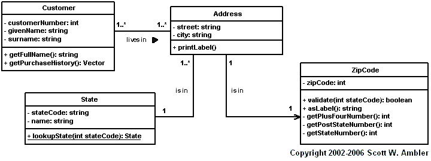
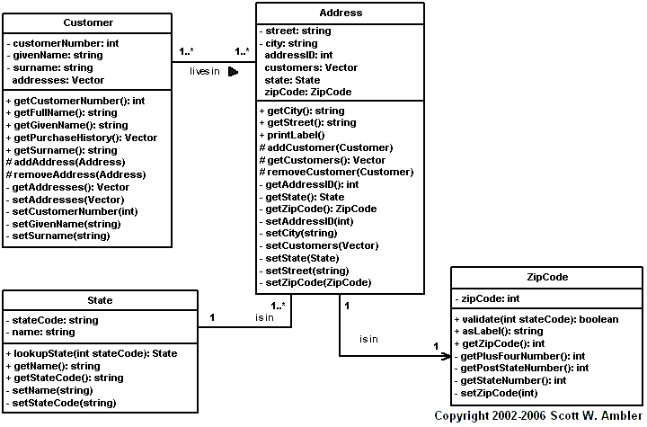

> 原文：<http://www.agiledata.org/essays/impedanceMismatch.html>

本記事は、[Agile Database Techniques](http://www.ambysoft.com/agileDatabaseTechniques.html) Chapter 7から抜粋。

オブジェクト指向技術はデータと振る舞いを持つオブジェクトを使ったアプリケーションの構築をサポートする。
リレーショナル技術はテーブルへのデータの保管をサポートする。
また、データベース内部においてはストアドプロシージャ、外部からはSQL呼び出しを用い、データ操作言語（DML: Data Manipulation Language）を使ったデータの操作をサポートする。
さらに進歩したリレーショナルデータベースもあり、それらは内部的にオブジェクトもサポートするようになっている。
こうした傾向は今後もさらに強まるだろう。
多くの組織において、オブジェクト技術とリレーショナル技術は一般的に使用されている。
その両方が組織に定着しており、複雑なソフトウェアを使ったシステムを構築するためにどちらも使用されていることは明らかである。
また、2つの技術が完全にフィットしていないこと、2つの間に「インピーダンスミスマッチ」が存在することもまた明らかである。

1990年代の前半、2つのアプローチの相違点は「オブジェクト―リレーショナル・インピーダンスミスマッチ（略して、インピーダンスミスマッチ）」と名付けられ、その呼び名は現在でもまだ一般的に使われている。
インピーダンスミスマッチに関する議論の多くは、オブジェクト技術とリレーショナル技術の技術的な相違点にフォーカスしている。
これは当然のことであり、両者には見かけ上の類似点がある一方で、微妙かつ重要な相違点があるからだ。

不幸なことに、オブジェクト指向コミュニティとデータコミュニティの文化的な相違点についてはほとんど注意が払われてこなかった。
文化的な相違点は、プロジェクトチームがどういうアプローチを取るべきかについて、オブジェクト専門家とデータ専門家が議論する際に明らかになる。

# 1. アジャイルDBAの役割
技術面におけるアジャイルDBAの仕事は、オブジェクト技術とリレーショナル技術が共に機能するようにアプリケーション開発者と一緒に働くことである。
文化面におけるアジャイルDBAの役割は、アジャイルソフトウェア開発者と伝統的なデータ専門家との間の仲介者となるだろう。
すなわち、アジャイルDBAは、アジャイル世界と伝統的世界の間の架け橋のごとく、オブジェクトとデータ世界の間の架け橋として振舞うわけだ。

# 2. 技術的インピーダンスミスマッチ
なぜ、技術的なインピーダンスミスマッチが存在するのだろうか？ 
オブジェクト指向パラダイムは、証明されたソフトウェア工学の原則に基づいている。
一方、リレーショナルパラダイムは証明された数学的な原則に基づいている。
つまり、基礎をなすパラダイムが異なるため、2つの技術はシームレスに連携できないのだ。

好ましいアクセス方法を比べてみると、両者のインピーダンスミスマッチが明らかになる。
オブジェクトパラダイムの場合、オブジェクトはリレーションシップを介してトラバースする。
一方、リレーショナルパラダイムの場合、テーブルのデータ列をジョインする。
この根本的な違いがあるために、オブジェクト技術とリレーショナル技術の組み合わせは理想的なものにならない。
異なる2つの物を一緒に使ったときに、何の問題もなかったことがあるだろうか？

オブジェクトとリレーショナルデータベースを一緒に使って成功を収めるには、両者のパラダイムと相違点を理解し、その知識に基づいて賢いトレードオフを行う必要がある。
リレーショナルパラダイムを理解するための十分なバックグラウンドを提供するため、[リレーショナルデータベース基礎](RelationalDatabases101)ではリレーショナルデータベースについて解説している。
[データモデリング基礎](DataModeling101)ではデータモデリングの基礎について記述している。
同様に、オブジェクト指向パラダイムの基礎を説明するため、[オブジェクト指向基礎](ObjectOrientation101)ではオブジェクト指向とUMLを解説している。
両方のパラダイムを理解し、両方の技術を実践するまでは、見かけ上の類似点を見抜くことは難しいだろう。

# 3. 見かけ上の類似点と微妙な相違点
図1は[データモデリング用UMLプロファイル（非公式版）](AnUnofficialUMLProfileforDataModeling)を用いた物理データモデル(PDM: physical data model)である。
図2はUMLクラス図である。
外見上はとても似ているように見えるし、実際似ている。
大きく違うのは、この2つの図にどのようにたどり着いたのかだろう。

*図1: 物理データモデル（UML表記）*

2つの図の見かけ上の類似点について検討してみよう。
どちらの図も構造を表している。
物理データモデルは2つのデータベーステーブルとそれらのリレーションシップを示しており、UMLクラス図は2つのクラスとそれらのリレーションシップを示している。
どちらの図もデータを表している。
物理データモデルはテーブル内のカラムを示しており、クラスモデルはクラスの属性を示している。
どちらの図も振る舞いを表している。
図1の``Customer``テーブルは削除トリガーを含み、図2の``Customer``クラスは2つの操作を含んでいる。
2つの図は似たような表記法を用いている（私が意図したところであるのだが）。
このUMLデータモデリングの記法は、他の業界標準のものと比べて、UMLの標準記法とほとんど相違点がない。

*図2: UMLクラスモデル*

モデリングのアプローチにおける相違点は、オブジェクトスキーマとデータスキーマの微妙な相違点につながる。

- クラス図においてデータと振る舞いの両方を考慮したことで、データのみが考慮されたデータモデルとは異なる構造が作成された
- [データモデリング](DataModeling101)におけるデータ正規化 対 [クラスモデリング](ObjectOrientation101)におけるクラス正規化
- データアナリシスパターン([Hay 1996](http://www.amazon.com/exec/obidos/ASIN/0932633293/))と、オブジェクト指向アナリシスパターン([Fowler 1997](http://www.amazon.com/exec/obidos/ASIN/0201895420/); [Ambler 1997](http://www.ambysoft.com/buildingObjectApplications.html))とデザインパターン([Gamma他 1995](http://www.amazon.com/exec/obidos/ASIN/0201633612/))

各々のモデルがサポートするリレーションシップの種別にもいくつかの相違点がある。
クラス図でのリレーションシップは、リレーショナルデータベース用の物理データモデルよりも若干ロバスト（強固）である。
これは、技術の元々の性質のためである。
たとえば、図2の``Customer``と``Address``の間に多対多リレーションシップがあることが分かるだろう。
それが図1においては、関連テーブル``CustmerAddress``を介したリレーションシップが使用されている。
オブジェクト技術はこの種のリレーションシップをサポートするが、リレーショナルデータベースはサポートしない。
これが関連テーブルを導入した理由である。

図3はオブジェクトコミュニティ内での派閥の違いを明らかにしている。
クラス図ではキーを示さないのが一般的である([Ambler 2003](http://www.ambysoft.com/elementsUMLStyle.html))。
たとえば、図2ではキーは全く示されていない。
しかし、オブジェクトを保存するためにリレーショナルデータベースを使用する場合、各々のオブジェクトは自身と関連するリレーションシップをデータベースに書き出すため、自ら情報を管理しなければならない。
この情報は、私が「シャドウインフォメーション」（shadow information）と呼んでいるものである。
この情報は、属性に「実装」の可視性を付けて、図3に付け加えている（シンボルは記載していない）。
たとえば、``Address``クラスは``Address``テーブル内の``AddressID``に対応する``AddressID``属性を含む。
``Custemer``、``State``、``ZipCode``クラスへのリレーションシップを管理するために必要な``customers``、``state``、``zipCode``属性についても同様である。

*図3: 属性を完全に記述したUMLクラスモデル*

こうした派閥の違いは、オブジェクトコミュニティがオブジェクト永続化の重要性を過小評価する傾向があることを示している。こうした問題の兆候は以下のとおりである。

- UMLにおけるオフィシャルなデータモデルの欠如（[データモデリング用UMLプロファイル（非公式版）](AnUnofficialUMLProfileforDataModeling)を参照）
- クラス図においてキーをモデル化しない習慣
- UMLクラス図にいくつかのステレオタイプを適用することで、システムの永続化の側面をモデル化できるという誤った考え
- 多くの一般的なOOA&Dの書籍がオブジェクト永続化問題について、ほとんど（または全く）時間を費やしていない

だが実際には、オブジェクト開発者はオブジェクトを永続化するために（開発）時間の多くの部分を費やす必要があることに気づく。
おそらくそれは、[不適切なマッピング](mappingObjects)をしたあとで、パフォーマンスの問題に出くわしたり、[レガシーなデータ制約](LegacyDataConstraints)を設計上考慮しなかったことが発覚したからである。
私自身の経験では、永続化は多くのオブジェクト開発者にとっての重大な盲点であり、以下で議論する文化的インピーダンスミスマッチを助長するものである。

# 4. 文化的インピーダンスミスマッチ

私が「オブジェクト−データディバイド」([Ambler 2000a](http://www.sdmagazine.com/documents/s=746/sdm0003j/0003j.htm), [Ambler 2000b](http://www.sdmagazine.com/documents/s=745/sdm0004k/0004k.htm))と呼ぶ文化的なインピーダンスミスマッチは、オブジェクトコミュニティとデータコミュニティの間の政治性に関わっている。
この政治性とは、特に、オブジェクト指向開発者とデータ指向開発者がともに働くときに直面する「難しさ」である。
これは一般に、IT組織のみならず、IT業界全体でも起こっていることだが、
2つのコミュニティ間における政治性の機能不全である。
アジャイルデータ(AD)メソッドはこれらを克服しようと努力している。
オブジェクト−データディバイドの症状は、オブジェクトを保存するためにリレーショナル技術を使用するべきではない、もしくはできないと主張するオブジェクト開発者や、オブジェクト/コンポーネントモデルはデータモデルによって駆動されるべきであると主張するデータ専門家に見られる。
多くの偏見のように、これらの考えは全く事実に基づいていない。
[リレーショナルデータベース基礎](RelationalDatabases101)において、リレーショナルデータベースはオブジェクトを表現するデータを含む広範なデータを格納するために使用されることを知った。
そして、において、データ駆動アプローチに加えて開発のアプローチにいくつかの方法があることを学んだ。

われわれの業界がオブジェクト−データディバイドに悩まされている理由を理解するため、オブジェクト技術の歴史を考える必要がある。
オブジェクト技術は最初1960年代の後半に世に広められ、1980年代の後半と1990年代の前半にビジネスコミュニティに適用された。
現在でさえ多くの組織は、ミッションクリティカルソフトウェアにオブジェクト技術をちょうど使い始めたところである。
他の多くの新しい技術と同じように、最初、オブジェクト（技術）の周りには人目を引くような誇大広告が存在した。
- 全てはオブジェクトである。オブジェクト技術は全ての問題を解決する銀色の弾丸である。オブジェクトは理解しやすく、扱いやすい。あなたが必要とするものは、オブジェクト技術である。*
やがて、現実が明らかとなり、これらの主張の正体が解明された。
これは、せいぜい希望的観測に過ぎないと。
ただ、不幸なことに、ある誇大広告が重大なダメージを与えた。
objectbase（オブジェクトデータベース）に裏打ちされた純粋オブジェクト指向アプローチが、「疑わしい」リレーショナル技術の使用をすぐに凌駕するだろうという考えである。
この誤った考えは、
オブジェクト手法と構造化手法が実践ではうまく混ざらないことを示すいくつかの示唆的なリサーチ結果と結び付けられ、
オブジェクトコミュニティ内の多くの人々にとって、
オブジェクトとリレーショナルデータベースは一緒に使用すべきでないという主張へとつながった。

同時に、データコミュニティは自身の結論に到達した。
伝統的なメインフレーム世界においてはすでに重要な役割であったデータモデラーは、2層クライアントサーバ世界（当時の新たなアプリケーション開発における有力なテクノロジー）での自身の役割が同様に重要であることに気づいた。
両方の世界における開発は同じように行われた。
データ専門家はデータスキーマを開発し、アプリケーション開発者はプログラムコードを書く。
2つの仕事に概念的なオーバーラップがほとんどないため、このやり方は機能した。
データモデルはデータエンティティとリレーションシップを示し、アプリケーションモデルおよびプロセスモデルは、アプリケーションがどのようにデータを扱うかを示した。
データ専門家の観点から見ると、世界はほとんど変化しなかった。
その後、オブジェクト技術が生まれた。 
オブジェクト技術はソフトウェアを開発するための全く新しい方法である、とすぐに認識したデータ専門家も存在した。
私もその一人であり、成長しつつあるオブジェクトの群衆に参加した。
不幸なことに、多くのデータ専門家は、オブジェクトパラダイムが失敗が運命付けられた一時的な熱狂であるか、単にプログラミング技術に過ぎないと信じた。
それゆえ、現状に満足したままだった。

不幸なことに、両方のコミュニティは誤解していた。
オブジェクト純粋主義者にとっての落胆は、objectbaseがニッチな技術以上のものであることが証明されなかったことである。代わりに、リレーショナルデータベースがデータ保管のための事実上のデファクトスタンダードとなった。その上、80年代後半と90年代前半のリサーチによって、C++やSmalltalkといったオブジェクト実装言語に構造化モデルを使用できないこと、オブジェクトモデルにCOBOLやBASICといった構造化実装言語を使用できないことが示された。
彼らは、オブジェクトプログラミング言語とリレーショナルデータベースといった実装技術と上手くやるために、オブジェクトモデル手法と構造化モデル手法を混ぜるというアイディアには取り組まなかった。
実際、オブジェクトをリレーショナルデータベースにマッピングすることが合理的にみて簡単であることを経験が示してきた。

データ専門家にとっての落胆は、オブジェクトモデリング手法、特に[UML](http://www.modelingstyle.info/)が、データモデリング手法に比べて著しく強固であり、ほぼ間違いなくデータモデリングのスーパーセットであるということだった([Muller 1999](http://www.amazon.com/exec/obidos/ASIN/1558605150/)。
オブジェクト手法はデータ手法にとって変わった。
しかし実際には、多くのデータ専門家たちが「クラス図は操作が付け加えられたデータモデルに過ぎない」と誤ってしまうという致命的な概念的オーバーラップがある。
データ専門家たちは、その微妙な違いを認識できなかったのである。
彼らが認識できなかったのは、多くの図を必要とする振る舞いのモデリングの複雑さである。
多くの図を必要とするため、UMLではモデル図が定義されている。
また、現代のアプリケーション開発のニーズからすると、
「データのみにフォーカス」していては視野が狭すぎるのである。
実践ではオブジェクト手法は上手く機能することが証明されており、オブジェクト技術は単なる流行というだけではなく、有力な開発プラットフォームとなっている。
現状では、多くの現代的開発手法が数ページをデータモデリングに費やすというところまで両者の歩み寄りの状況は変わっている（それはオブジェクト指向の瑕疵のため）。

オブジェクト−データディバイドは、以下のような恐ろしい結果をもたらす。

1. ITプロジェクトチームは時間通り、予算内でソフトウェアを開発することができない
1. 技術的インピーダンスミスマッチが増幅する
1. オブジェクトモデルのドライバーとしてデータモデルは貧弱であると証明されてしまう
1. メンバの離職率の増加

# 5. オブジェクト―リレーショナル・インピーダンスミスマッチを乗り越えるための戦略

オブジェクトとリレーショナル技術は現実のものであり、たぶん両者とともに仕事をしているだろうし、それらは普及している。不幸なことに、2つの技術は異なっており、相違点は「オブジェクト―リレーショナル・インピーダンスミスマッチ」と呼ばれている。本章では、インピーダンスミスマッチに技術的側面と、文化的側面の2つの側面が存在することを学んだ。

技術的なミスマッチはアプリケーション開発者とアジャイルDBAの両者を含むプロジェクトチームのメンバーが、両方の技術の基礎を理解することを確実にすることで、乗り越えられる。
さらに、できる限りデータベースへのアクセスをカプセル化すること、データベースを上手く設計すること、データベースリファクタリングによって設計をクリーンに保つことで、関係するデータベーススキーマの結合性を削減するように積極的に試みるべきである。

文化的インピーダンスミスマッチを乗り越えることはずっと難しいことである。
問題が存在し、乗り越える必要があることを皆理解する必要がある。
オブジェクトとデータ専門家は異なるスキルを持ち、異なるバックグラウンドを持ち、異なる哲学を持ち、好きな働き方も異なる。
これらの相違点を利用して共に働く方法を探す代わりに、多くのIT企業では、2つのプロフェッショナルグループの間にコミュニケーションおよび政治的な障壁を立てることを選択してきた。
これらの障壁は取り除かれるべきであり、アジャイルデータ(AD)メソッドの適用によって解決できる。
重要な最初のステップは、「プロジェクトが違えばアプローチも異なる」ことと、1つの「プロセスサイズ」がすべてのプロジェクトにフィットしないということを認識することと、それから、適切に管理することである。
データグループだけが正しくても十分ではない。
アプリケーショングループだけが正しくても十分ではない。
共に正しくあることが必要なのである。
政治的なゲームをするのをやめて、共に働く方法を見つけよう。

# リファレンスとお勧めするオンラインの読み物

以下のエッセイが参考になるかもしれない。

- [オブジェクトをリレーショナルデータベースにマッピングする](Mapping101)

本書は、ソフトウェア開発者とデータベース管理者とが、
エクストリームプログラミング（XP）、
ラショナル統一プロセス（RUP）、
ユーザ機能駆動型開発（FDD）、
ダイナミックシステム開発メソッド（DSDM）、
エンタープライズ統一プロセス（EUP）といった
革新的なソフトウェア開発プロセスを適用したプロジェクトで、
「一緒に働く」ために必要な哲学とスキルを示している。

# 翻訳履歴

- 2004-10-12 (火) 18:00:41 kdmsnr : もうちょっとサラっと読ませたいですねえ。ううむ。
- 2004-10-12 (火) 17:54:08 WR : ありがとうございます
- 2004-10-12 (火) 17:44:06 kdmsnr : ぎこちないですが、★の数を減らしてみました。
- 2004-10-10 (日) 03:07:00 WR : イマイチわからんところがたくさんある(★)のですが、一応載せときます。後はえろいひとに期待

