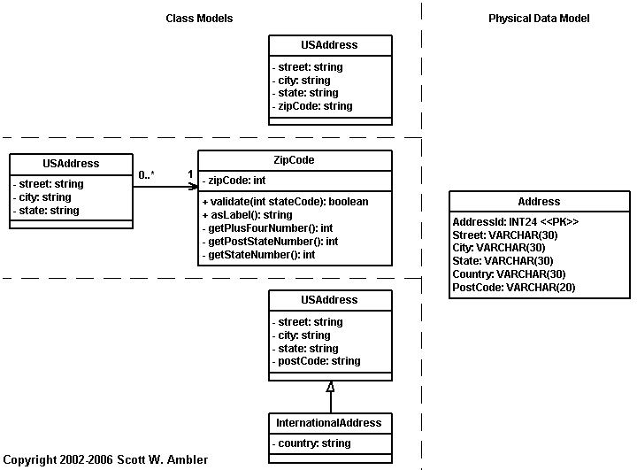
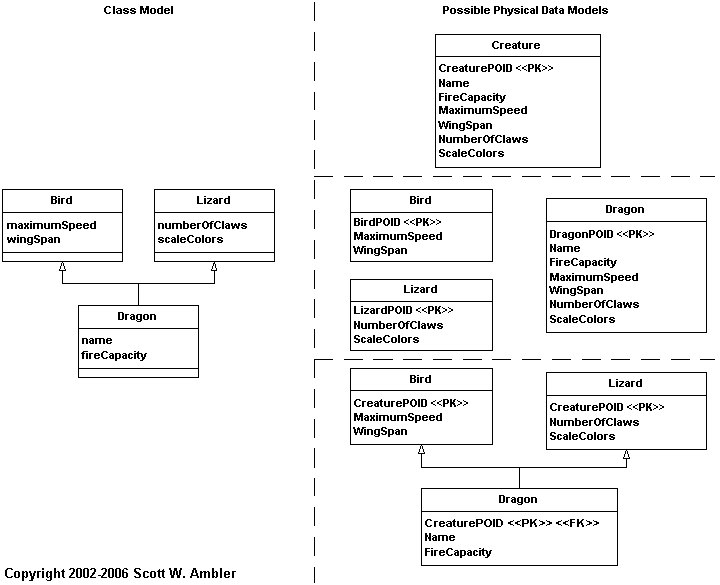

> 原文：<http://www.agiledata.org/essays/drivingForces.html>

この記事は、[Agile Database Techniques](http://www.ambysoft.com/agileDatabaseTechniques.html) Chapter 3より抜粋。

私が何度もお目にかかる問題に、
「データモデルはオブジェクトの開発を駆動しなければならない」
というものがある。
この考えには2つの意味がある。
まず、「物理データスキーマはオブジェクトの開発を駆動しなければならない」という意味。
それから、「概念および論理データモデルはオブジェクトの設計を始める前に、
（ほぼ）完璧に開発し終えていなければならない」という意味だ。
どちらの考えも非アジャイルプロジェクトでは不適切とされており、
アジャイルプロジェクトにおいては明らかに間違いとされる。
それでは、この問題について深く掘り下げてみよう。

なぜオブジェクトモデルを既存のデータスキーマを基に構築しようとするのだろうか？
第一に、現在のスキーマの裏にある「考え方」を再利用したいからではないだろうか。
私は再利用の熱心な信奉者だが、再利用するなら妥当なものを再利用したい。
だが、オブジェクトパラダイムとリレーショナルパラダイムの間には、
インピーダンスミスマッチが存在している。
このミスマッチのために、
オブジェクト設計者とデータ設計者はまったく異なった設計を行ってしまう。
[オブジェクト指向基礎](ObjectOrientation101)を読むと、オブジェクト開発者が、
[データモデリング基礎](DataModeling101)でデータモデラーが採用した手法や考え方とは異なる手法、考え方を用いていることが分かるだろう。
次に、データベース管理者が組織内の標準を維持、さらには強固にすべく、
アプリケーションを構築する際には既存の設計を基にするよう
強要しているからではないだろうか。
最後に、この手法を採用するよう頼んでくる人たちが、
この決定がどういう意味を持つか理解していない、
あるいは、もっと良い方法があることを知らないのではないだろうか。

なぜオブジェクトモデルを既存のデータスキーマを基に構築してはいけないのか？
第一に、[レガシーデータベース](TheJoyOfLegacyData)の設計にはいくつかの致命的な問題があるからだ。
私は既存の物理データモデルを見ていま何が行われているかとか、
技術的な制約は何なのかといったことを理解し仕事に取りかかるのだが、
ダメなデータベース設計のままアプリケーション開発を行おうとは思わない。
次に、たとえデータベース設計が非常に優秀だったとしても、
オブジェクトをリレーショナルデータベースにマッピングするには
大きな溝があるからだ。
図1を見て欲しい。3種類のオブジェクトスキーマが描かれてある。
それらはすべて、右側のデータスキーマに正確にマッピングすることができる。
それでは、データスキーマを基に作業を開始するとしよう。
3つのオブジェクトスキーマのうち、データスキーマから生成するならどれだろうか？
……一番上？ データモデルから生成されたというのなら、これかもしれない。
だが、残り2つのほうが良いという可能性が無いわけでもない。
そう。図1のモデルはすべて改良の余地がある。
しかし、オブジェクトスキーマとデータスキーマのマッピングの違いを表す
シンプルな例題が必要だったのだ。

*図1. 複数のクラスがひとつのテーブルにマッピングされている。*

なぜデータモデルをプロジェクトの早期に（ほぼ）完璧に完成させたいのか？
第一に、これは組織に残る文化を反映したものだからだ。
今までずっとやってきたやり方だから、このやり方が好きだから、
だから、これからもずっとこのやり方でやっていくというわけだ。
第二に、データモデリングしか知らないからではないだろうか。
いや、さすがにそれはないにしても、
専門にするならデータモデルの方がいいと思っているのだ。
金槌を持つと何でも釘に見えて叩きたくなってしまうが、
釘というものは今すぐに対処しなくてはならない最も重要な問題である（慎重に扱わなければならない）。
第三に、マインドセットが硬直化しているからだ。
多くの開発者は、反復的漸進的開発を行ったこともなければ、
革新的な開発アプローチの第一歩を踏み出したことすらない。
第四に、変更コストが高いと思っているからだ。
アジャイル手法を採り入れていなければ、変更コストは高い。
しかし、[データベーススファクタリング](TheProcessOfDatabaseRefactoring)や[アジャイルモデリング](AnIntroductionToAgileModeling)など現代の技術を使えば、
変更コストはずいぶん押さえられる。こういった技術が変更をサポートするからだ。
第五に、データグループはアプリケーションプログラマから離れてデータベースを構築し、
アプリケーションプログラマはデータグループから離れてアプリケーションを構築するものだと思っているからではないか。
COBOLのプロジェクトならこれでもうまくいっただろう。
しかし、アジャイルソフトウェア開発チームではこれだとうまくいかない。
チームはひとつ。一致団結。バラバラに作業をやってはいけない。

なぜオブジェクトモデルを概念データモデルや論理データモデルを基に構築してはいけないのか？
実は、反復的漸進的開発を行っていれば、
それほど悪い考えではない。
問題は、上流での設計(BDUP: big design up front)手法にある。
データ専門家はこの手法を好むのだ。
概念モデリングの段階から革新的な開発手法を採り入れることもできるが、
この上流設計という手法を採らざるを得ないだろう。
手法を柔軟に変えていくことは、成功のためには必要不可欠だ。
しかし、それよりももっとよい方法がある。
オブジェクトロールモデリング記法（{{isbn('1558606726','Halpin 2001年')}}）はすばらしいが、
CRC（Classes, Responsibilities, Collaboration：クラス、責務、協調）カード法([Beck & Cunningham 1989; Ambler 2001a](http://www.ambysoft.com/theObjectPrimer.html))はプロジェクトのステークホルダーと一緒になってドメインモデリングを行うのに、非常に有用な技法である。
同様に、論理データモデルも非常に有用だが、
個人的にはUMLクラス図の方が表現力があるように思う。
データだけでなく、振る舞いも描けるからだ。
David Hay (2003年) は名著『{{isbn('0130282286','Requirements Analysis')}}』の中で、
UMLクラス図をドメインモデルや分析モデルに使うべきではないと主張している。
しかし、私の経験では、UMLを使うと決めなければ、非常に簡単に行うことができる(my experience is that you can do so quite easily if you choose not to )。★
（Hayも同様の考えを持っている。ただ、彼はデータモデルを好むが、私はUMLを基にしたモデルを好む）
しかしながら、多くのオブジェクトモデラーは分析段階で苦しんでいる
という彼の指摘は認めなくてはならない。
しかし、それはまた別の話だ。

では、オブジェクトスキーマを基に盲目的にデータスキーマを構築すればいいのだろうか？
否ッ！
より堅牢な手法が必要となる。
図2に、3種類のデータスキーマが描かれてある。
それぞれ異なる[継承のマッピング方法](Mapping101)を適用した結果である。
多重継承のマッピングは簡単であり、
図2には特筆すべき点はない。
ポイントとなるのは、あるオブジェクトスキーマは
複数のデータスキーマに正確にマッピング可能だという点である。

*図 2. 複数のインスタンスのマッピング*

図1では、複数のオブジェクトスキーマがひとつのデータスキーマにマッピングできることを示した。
図2では、ひとつのオブジェクトスキーマが複数のデータスキーマにマッピングできることを示した。
オブジェクトとリレーショナルデータベースをうまくマッピングするスキルが必要である。
モデルをひとつだけ作ればいいのではなく、
CASEツールの「魔法のボタン」を押せばいいわけでもなく、
毎回、答えが見つかるわけでもない。

私からのアドバイス：

- **既存のレガシーデータベースは技術的制約だと認識すること。**レガシーデータベースは石を削ったものではない。時間をかければリファクタリングできる。不完全なスキーマにマッピングすることになるかもしれないが、その経験は確実にモノになる。

- **反復的漸進的開発手法（モデリング手法を含む）を採用すること。**アジャイル開発者は、データモデリング、オブジェクトモデリング、リファクタリング、マッピング、実装、パフォーマンスチューニングといったタスクを繰り返しながら作業を進めていく。要求仕様からオブジェクトスキーマをつくり、そのオブジェクトスキーマからデータモデルとソースコードをつくる。そして、パフォーマンス課題やプラットフォームの特性（コードやDB）は、オブジェクトスキーマの設計変更へとつながらなければならない。これは論理的な作業手順である。オブジェクト技術とリレーショナルデータベースを一緒に用いるプロジェクトでは、オブジェクトモデルを設計する前に分析（ドメイン、概念）モデリングを行うとよい。オブジェクトモデルは、物理データモデルの設計へとつながる。その後、2つのモデルをマッピングする。そして、パフォーマンスチューニングを考慮してリファクタリングしていく。実際の開発では、この手順はさほど気にならなくなるだろう。

- **アジャイルモデリングの「複数のモデル」原則を採用すること。**実際の開発現場では、データモデルにせよUMLクラス図にせよ、ひとつのモデルで十分なことなどあり得ない。ひとつのモデル記法しか使えないモデラーは、工具箱に金槌しか入ってない大工みたいなものではないか——そんなプロジェクトは進行困難だし、最悪な場合、致命的な危機に陥ってしまう。クラスモデルはデータに加え振る舞いも記述しているためデータモデルよりも多くの情報が記述されているが、クラスモデルだけでは不十分だ。

- **チーム一丸となるべし。**「奴ら」と「俺ら」ではない。「我々」なのだ。データチームがどっかに行ってデータモデルを作るとか、彼らがデータモデルを"授ける"と、開発がスタートするとか、そんなのアジャイルじゃない。アジャイルじゃなくても、そんなのダメだ。私が言えることはただひとつ。「そんなの何の役にも立たない」。最悪なのは、派閥を正当化するとか、プロジェクトチームを失敗させるとか（！）、そんなどーでもいいような政治な問題のために、わざとこういったことが行われているということである。

- **様々なモデリング手法に対応できるよう準備しておくべし。**「[プロジェクトにより戦略は変わる](DifferentProjectsRequireDifferentStrategies)」を参照のこと。

- **成功を勝ち取るべし。**多くのひとは、自分には力がないと思ってる。だが、今いる組織をよりよくしたいと思うなら、自ら変えていくしかない。手始めに、アジャイルな考え方を周りの開発者に紹介してみてはどうか。ただし、彼らには選択権がある。彼らが自らの環境をよりよくしたいと思うなら、アジャイルを選ぶはずだ。時には転職を考えることもいいかもしれない。

ここでの問題は「どちらのモデルを使えばよいか」ではなく、
本当は「いかに協力して効果的に仕事ができるか」なのである。
オブジェクトだのデータだの「宗教論争」はもう止めにして、
IT業界における文化的インピーダンスミスマッチを解消するための第一歩を踏み出そうではないか。

# 参照

『Agile Database Techniques』が発刊された。本書は、ソフトウェア開発者とデータベース管理者とが、エクストリームプログラミング（XP）、ラショナル統一プロセス（RUP）、ユーザ機能駆動型開発（FDD）、ダイナミックシステム開発メソッド（DSDM）、エンタープライズ統一プロセス（EUP）といった革新的なソフトウェア開発プロセスを適用したプロジェクトで、「一緒に働く」ために必要な哲学とスキルを示している。
