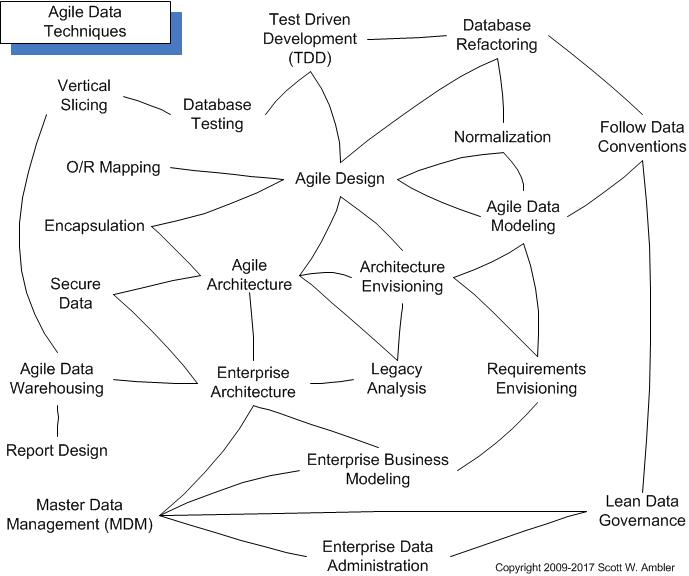

# 概略
聞くところによると、大規模なミッションクリティカルプロジェクトは65〜85%の確率で失敗しているのだそうだ。これは[Standish GroupのChaos Report](http://www.standishgroup.com/) によるものだが、一番低い65%でも、相当ヤバい数字だ。この数字は長年改善されずにきてしまった。その上、ますます悪くなっているようだ。私が思うに、これは、ソフトウェア開発の伝統的な手法が機能していないことを示す明らかな証拠なのではないだろうか。もちろん、伝統的技法がうまく機能しているという研究結果は数多く出ている。きちんと採り入れ、きちんと従いさえすれば、伝統的技法だってうまくいくかもしれない。開発者が言われたとおりに仕事をすれば、伝統的技法だってうまくいくかもしれない。理論上は何だって言える。しかし、実際は、開発者は伝統的技法を採り入れていないし、そういう素振りも見せない（少なくとも業界全体を見ると）。つまり、多くのデータ専門家、および、データモデリング専門家に好まれている伝統的技法は、成功するチャンスがないということだ。我々には新たなアプローチが必要なのだ。アジャイルソフトウェア開発技法こそが最善の策である。アジャイルデータ方法論（およびアジャイルデータベース技法）は、成功するチャンスのある手法である。なぜなら、みんなが、実際に、実践できる手法だからだ。これは耳あたりの良い諸学説の単なる寄せ集めではない。

# アジャイルソフトウェア開発者の基礎知識
- [リレーショナルデータベース基礎](RelationalDatabases101)
- DataModeling101
  - Agile Data Modeling: FromDomainModelingtoPhysicalModeling
  - AnUnofficialUMLProfileforDataModeling
  - WhyDataModelsDontDriveObjectModels (And Vice Versa)
- [オブジェクト指向基礎](ObjectOrientation101)
  - TheDiagramsofUML2.0 (posted at www.agilemodeling.com) 
- [オブジェクト―リレーショナル・インピーダンスミスマッチ](TheObject-RelationalImpedanceMismatch)
- TheJoyOfLegacyData
- BecomingAgile

# 進化的開発技術と成功要因
- EvolutionaryDevelopment 
- AnIntroductionToAgileModeling 
- Test-DrivenDevelopment 
- TheProcessOfDatabaseRefactoring 
  - CatalogOfDatabaseRefactorings 
- Mapping101
- EncapsulatingDatabaseAccess 
- ToolsSandboxesAndScripts 

# アジャイルデータベース開発技術
- [並行処理制御入門](ImplementingConcurrencyControl)
- ImplementingReferentialIntegrityAndSharedBusinessLogic 
- FindingObjectsInARelationalDatabase
- ImplementingReports
- ImplementingSecurityAccessControl
- AdvancedXML?NoJustRealisticXML

# アジャイルデータ(AD) 手法
- [アジャイルデータ手法のビジョン](AVisionForTheAgileDataMethod)
- TheRolesOnAgileDataProjects
- Agile Enterprise Architecture: BeyondEnterpriseDataModels  
  - ArchitectureAndArchitecturalModelingTechniques  
- Agile Enterprise Administration: BeyondDataAdministration   
- DifferentProjectsRequireDifferentStrategies 
- AdoptingAgileDatabaseTechniques 

# その他
- DataAndTheRUP
- References

# 重要なリンク
- AgileDatabaseTechniquesTraining 
- CaseStudiesandExperienceReports 
- ProvideFeedbackViaTheAgileDataMailingList
- Links
- AboutThisSite  
- Help

